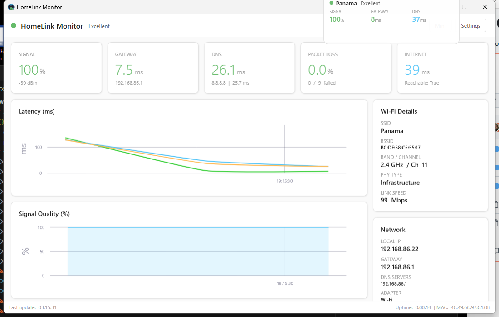
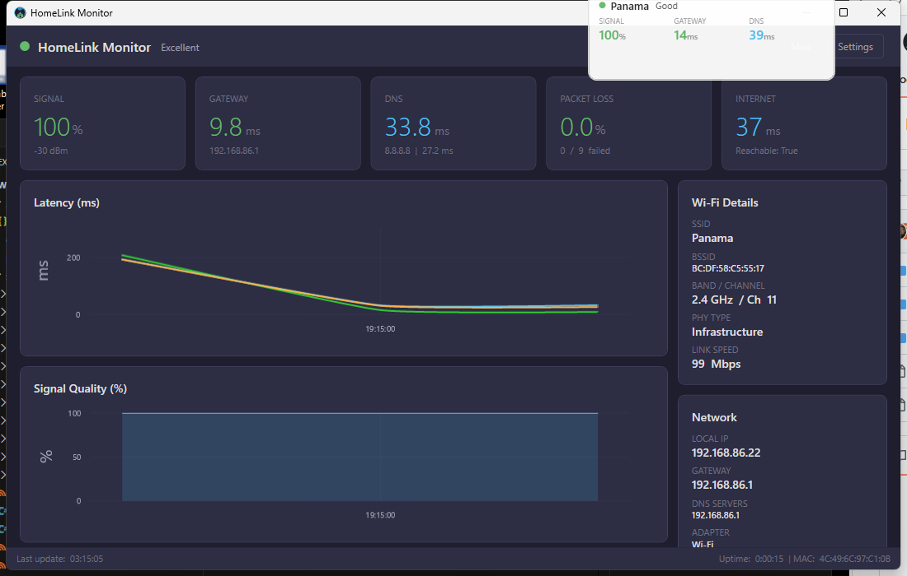

# HomeLink Monitor

A real-time Wi-Fi link health and internet connectivity monitor for Windows. Built with .NET 8 and WPF.



## Features

- **Real-time Wi-Fi metrics** - Signal strength, RSSI, BSSID, band, channel, link speed, PHY type
- **Latency monitoring** - Continuous ping to gateway, DNS servers (Google 8.8.8.8, Cloudflare 1.1.1.1), and HTTP endpoints
- **Live charts** - Latency and signal quality history with GPU-accelerated rendering (LiveCharts2 + SkiaSharp)
- **DNS probe** - Per-server DNS query timing
- **HTTP probe** - Internet reachability and captive portal detection
- **Packet loss tracking** - Running totals with percentage display
- **Mini mode** - Compact always-on-top window showing key metrics at a glance, with a live latency sparkline
- **System tray** - Minimize to tray with context menu, double-click to restore
- **Alerts** - Configurable thresholds for signal, latency, and packet loss with Windows toast notifications
- **Roaming detection** - Tracks BSSID changes as you move between access points
- **Dark & Light themes** - Full theme support with runtime switching
- **SQLite persistence** - All metrics stored locally with configurable retention (raw: 7 days, aggregated: 90 days, alerts: 365 days)
- **Data export** - CSV and JSON export of chart data and alert history
- **Traceroute** - On-demand async traceroute with progressive display and interactive map visualization
- **Traceroute map** - Leaflet.js map with hostname-based geolocation, hop markers with IP/hostname tooltips, and route path lines (WebView2)

## Screenshots

### Dark Mode


### Light Mode


## Requirements

- Windows 10 (build 19041) or later
- For development: .NET 8 SDK

No runtime installation needed if using the self-contained published build.

## Getting Started

### Run from source

```bash
# Clone the repo
git clone https://github.com/Bullpuph123/HomeLinkMonitor.git
cd HomeLinkMonitor

# Build and run
dotnet run --project src/HomeLinkMonitor
```

### Publish self-contained exe

```bash
dotnet publish src/HomeLinkMonitor/HomeLinkMonitor.csproj -c Release -r win-x64 --self-contained true -p:PublishSingleFile=true -p:IncludeNativeLibrariesForSelfExtract=true -o publish
```

The output `publish/HomeLinkMonitor.exe` (~200 MB) runs standalone with no .NET installation required.

### Run tests

```bash
dotnet test
```

## Configuration

Settings are stored at `%APPDATA%\HomeLinkMonitor\config.json` and can be modified through the in-app Settings window.

| Setting | Default | Description |
|---------|---------|-------------|
| Polling Interval | 5s | How often metrics are collected |
| Theme | Dark | Dark or Light |
| Primary DNS | 8.8.8.8 | First DNS server to ping and query |
| Secondary DNS | 1.1.1.1 | Second DNS server to ping and query |
| Ping Timeout | 2000ms | Timeout for ping probes |
| HTTP Probe URL | msftconnecttest.com | URL for internet reachability check |
| Signal Low Threshold | 30% | Alert when signal drops below |
| Latency High Threshold | 100ms | Alert when latency exceeds |
| Packet Loss Threshold | 10% | Alert when packet loss exceeds |
| Raw Data Retention | 7 days | How long raw metrics are kept |

## Architecture

```
MonitoringOrchestrator (BackgroundService, 5s timer)
  ├── WifiMetricsProvider (ManagedNativeWifi)
  ├── NetworkInterfaceProvider (System.Net.NetworkInformation)
  ├── PingProbe (async ping to gateway + DNS servers)
  ├── DnsProbe (DNS query timing via DnsClient)
  └── HttpProbe (HTTP reachability + captive portal detection)
       │
       ├──> DataRepository (EF Core → SQLite, WAL mode)
       ├──> AlertEngine (threshold evaluation → toast notifications)
       └──> IMessenger (WeakReferenceMessenger → ViewModels → UI)
```

All probes run in parallel each cycle. ViewModels subscribe to typed messages and marshal updates to the UI thread.

## Tech Stack

| Component | Technology |
|-----------|-----------|
| Framework | .NET 8, WPF (MVVM) |
| MVVM | CommunityToolkit.Mvvm |
| DI / Hosting | Microsoft.Extensions.Hosting |
| Database | EF Core + SQLite |
| Charts | LiveChartsCore.SkiaSharpView.WPF |
| Wi-Fi API | ManagedNativeWifi |
| System Tray | H.NotifyIcon.Wpf |
| Notifications | Microsoft.Toolkit.Uwp.Notifications |
| Traceroute Map | Microsoft.Web.WebView2 + Leaflet.js |
| DNS Queries | DnsClient |

## Keyboard Shortcuts

| Shortcut | Action |
|----------|--------|
| Ctrl+M | Toggle mini mode |
| Right-click mini window | Switch back to dashboard |

## Project Structure

```
HomeLinkMonitor/
├── src/HomeLinkMonitor/
│   ├── Models/          # Data models (WifiSnapshot, PingResult, AppConfig, etc.)
│   ├── Data/            # EF Core DbContext and DataRepository
│   ├── Services/        # Monitoring probes, alerts, roaming, export
│   ├── ViewModels/      # MVVM ViewModels (Main, Mini, Settings, Tray)
│   ├── Views/           # WPF Windows (Mini, Settings)
│   ├── Themes/          # Dark and Light theme ResourceDictionaries
│   ├── Converters/      # Value converters (signal→color, latency→color)
│   ├── Helpers/         # CircularBuffer, NetworkHelper, AutoStartHelper
│   └── Assets/          # App icon
├── tests/HomeLinkMonitor.Tests/
│   └── UnitTest1.cs     # 29 unit tests
└── docs/images/         # Screenshots
```

## License

MIT License - see [LICENSE](LICENSE) for details.

## Author

**Geoff Huber**
